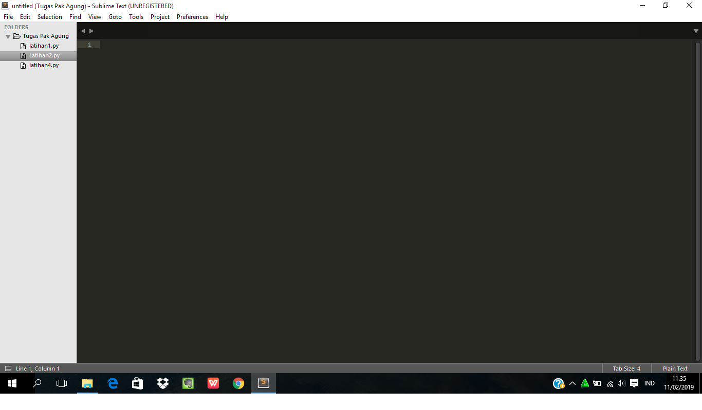
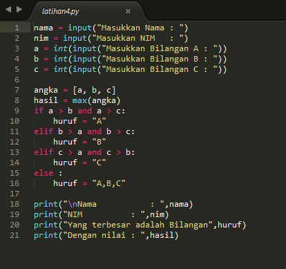
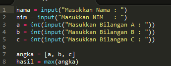
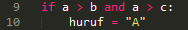
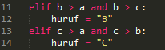
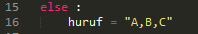
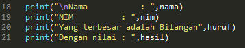
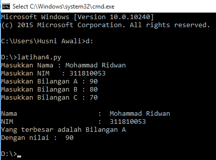
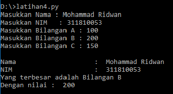
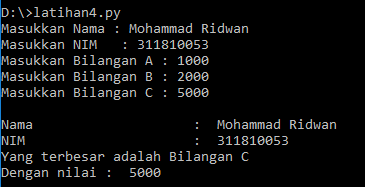

# Labpy1
## Macam - Macam Kondisional di Python

1. buka sublime text

2. masukan coding seperti berikut

3. kode input

4. kode if

5. kode elif

6. kode else

7. kode output

8. setelah itu buka cmd dan buka file py (python) yang tadi dibuat dan isi data seperti berikut, maka akan tampil seperti ini

   contoh bilangan A lebih Besar

   contoh bilangan B lebih Besar

   contoh bilangan C lebih Besar

sekian dan terimakasih
